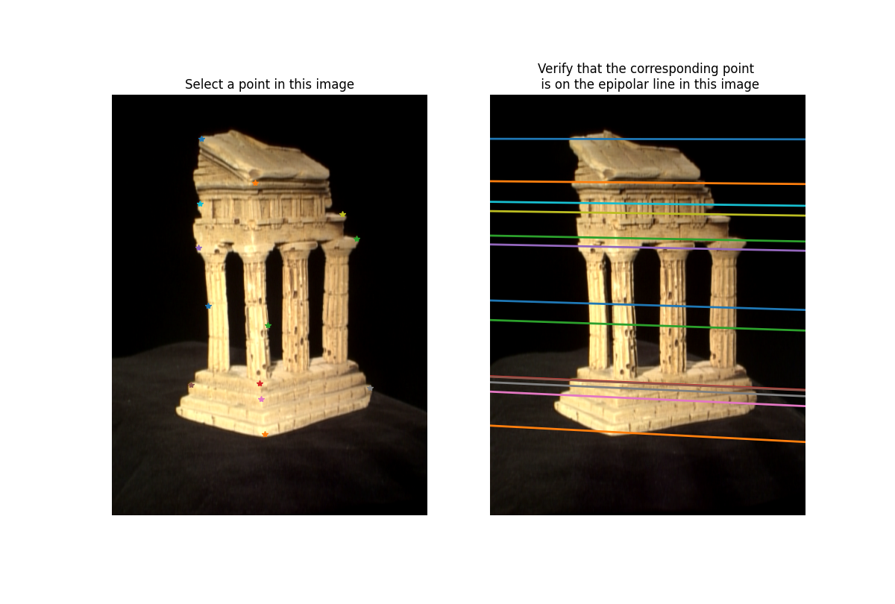
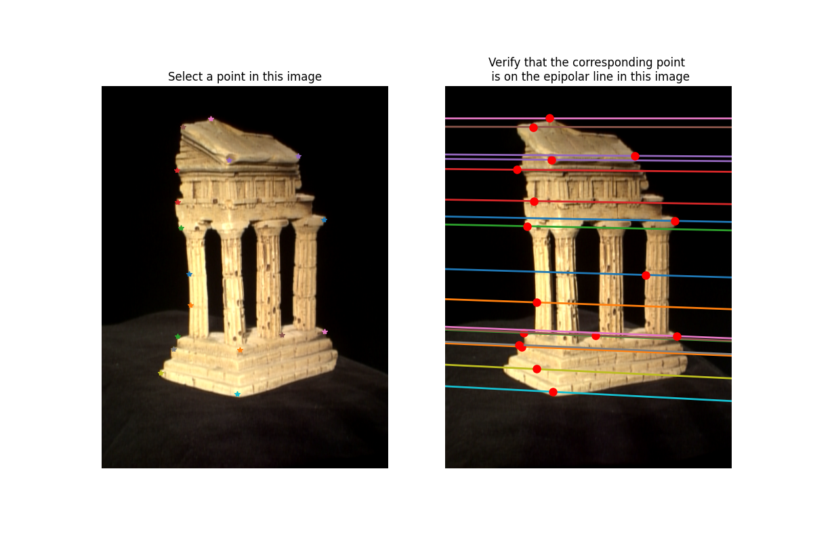
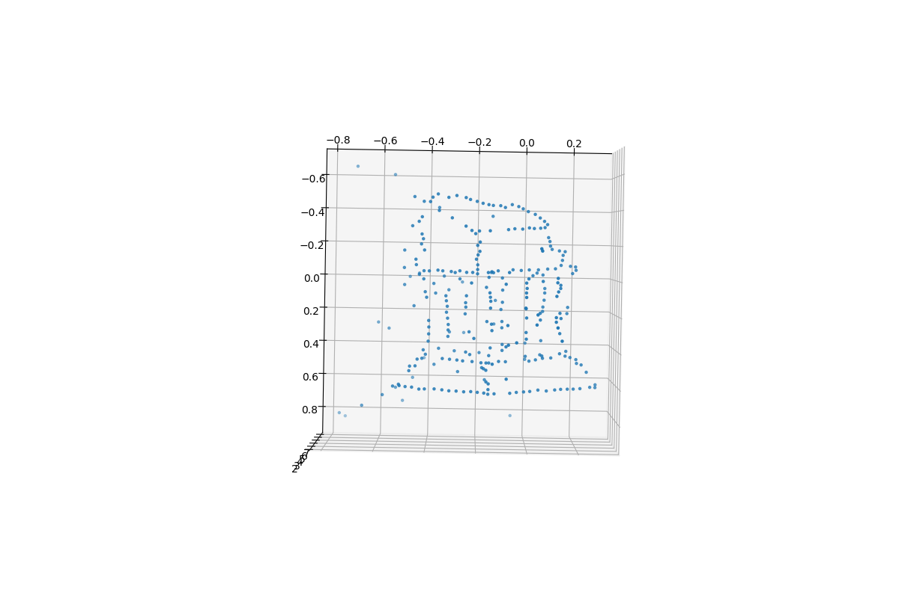
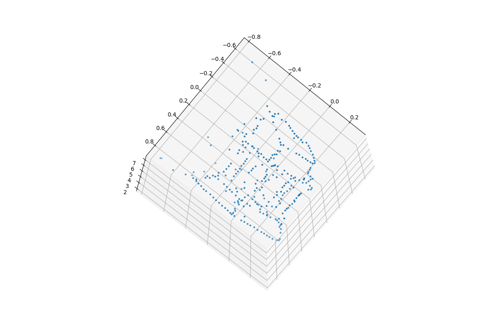
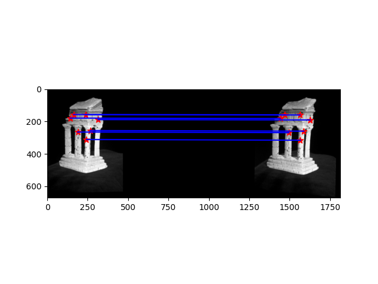
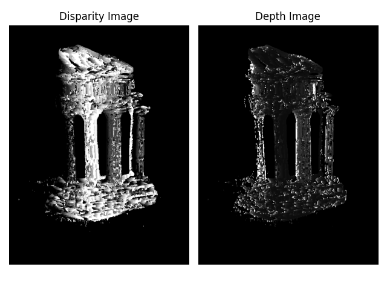

# 📸 3D Reconstruction 

This repository contains my implementation of **Sparse and Dense 3D Reconstruction** from stereo images of a temple.  
The work is divided into two major parts:  
- **Sparse Reconstruction** → Fundamental matrix, epipolar correspondences, triangulation  
- **Dense Reconstruction** → Rectification, disparity map, depth map  

All results are stored in the [`outputss/`](./outputss) folder.  

---

## 🏛️ Part 1 – Sparse Reconstruction  

### 🔹 2.1 Eight Point Algorithm 
**Task:** Implement the normalized eight-point algorithm to compute the Fundamental Matrix `F`.  

**My outputs:**  
- Estimated Fundamental Matrix `F`  
- Visualization of epipolar lines:  

  

---

### 🔹 2.2 Epipolar Correspondences 
**Task:** Find corresponding points in stereo images using the epipolar constraint.  

**My outputs:**  
- Similarity metric used: **SSD (Sum of Squared Differences)**  
- Epipolar match visualization:  

  

---

### 🔹 2.3 Essential Matrix 
**Task:** Compute Essential Matrix `E = K2ᵀ F K1` using intrinsics.  


### 🔹 2.4 Triangulation 
**Task:** Reconstruct 3D points from correspondences using projection matrices `P1`, `P2`.  

**My outputs:**  
- Correct `P2` chosen using positive depth constraint.  
- Reprojection error < **1 pixel**.  


### 🔹 2.5 Full Sparse Pipeline 
Script: `python/test_temple_coords.py`  
- Computes `F`, `E`, extrinsics, and triangulated points.  
- Saves extrinsic parameters → `data/extrinsics.npz`  
- 3D Reconstruction (2 views):  

  
   

---

## 🌆 Part 2 – Dense Reconstruction  

### 🔹 3.1 Image Rectification 
**Task:** Compute rectification matrices so that epipolar lines are horizontal.  

**My outputs:**  

  

---

### 🔹 3.2 Disparity Map 
**Task:** Compute disparity map with window matching on rectified images.  


### 🔹 3.3 Depth Map  
**Task:** Generate depth map from disparity using baseline and focal length.  

**My outputs:**  

  

---


 **📌 Notes** 

Epipolar matching works best on strong corners; may fail on textureless regions.

Dense disparity and depth depend on chosen window size and disparity range.

---

## 🚀 Running the Code  

```bash
# Run sparse reconstruction pipeline
python test_temple_coords.py

# Run rectification
python test_rectify.py

# Run dense reconstruction (disparity & depth)
python test_depth.py


